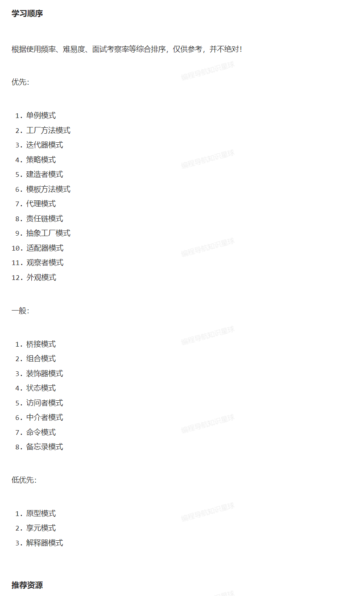
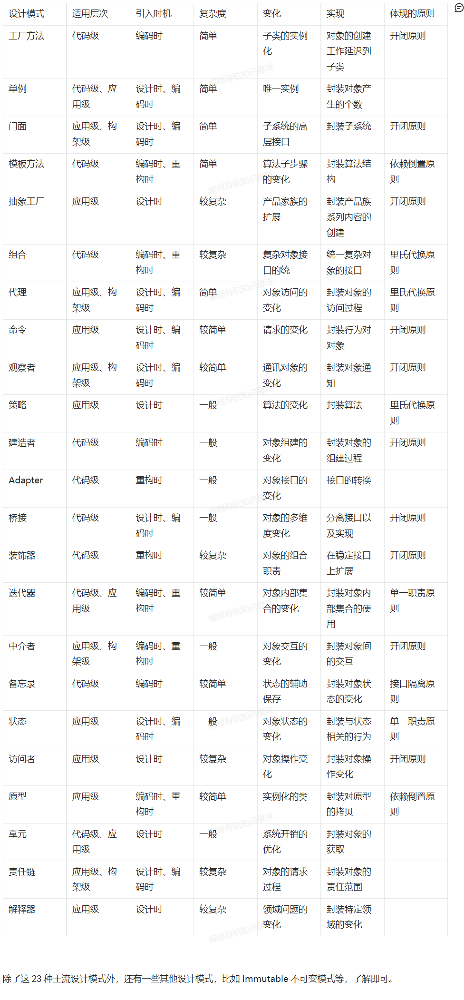

## 设计模式
各种设计模式的案例demo

#### 参考鱼皮链接

- 复杂度：

图片：

- 学习顺序

#### 书籍
《图解设计模式》：https://www.aliyundrive.com/s/jcQugLGNs1V 提取码: 5i9c（强烈推荐，用 Java 语言实现，图多、有示例代码、有习题和答案，很不错）
《大话设计模式》：https://www.aliyundrive.com/s/73jZWnfAtaA 提取码: 9gc7（比较有趣）
《Head First 设计模式》：https://www.aliyundrive.com/s/GnuQcruh7Us 提取码: 9gc7
《设计模式：可复用面向对象软件的基础》：https://www.aliyundrive.com/s/T9ECaPtxzg4 提取码: 9gc7（大黑书，难度较大，有能力和时间才去读）
《JavaScript 设计模式与开发实践》：https://www.aliyundrive.com/s/tzcZCU8bqnR 提取码: 9gc7（适合前端同学阅读）
《Python 设计模式》：https://www.aliyundrive.com/s/3RNoX31XqUy 提取码: 9gc7
视频
尚硅谷图解 Java 设计模式：https://www.bilibili.com/video/BV1G4411c7N4 （讲的很棒也很全面，也和一些主流框架相结合，系统学习 Java 的同学可以看）
五分钟学设计模式：https://www.bilibili.com/video/BV1af4y1y7sS （小短快科普，比较轻松）
黑马程序员Java设计模式详解：https://www.bilibili.com/video/BV1Np4y1z7BU （很完整，最后讲解了 Spring 框架的部分设计）
用一个项目讲解 23 种设计模式：https://www.bilibili.com/video/BV19g411N7yx （和项目结合，思路不错，但其中有一些直播翻车，可部分跳过）
文档
菜鸟教程：https://www.runoob.com/design-pattern/design-pattern-tutorial.html （还是比较推荐的，学过设计模式后如果忘记了，可以查看这个文档快速补回来）
C++ 图说设计模式：https://design-patterns.readthedocs.io/zh_CN/latest/
Go 语言设计模式系列博客：https://lailin.xyz/post/singleton.html

#### 资源
一些源码示例，仅供参考，更多的内容可以直接在 GitHub 搜索关键词 Design Pattern 或 设计模式 ：
各语言设计模式示例代码：https://github.com/wx-chevalier/design-pattern-examples
Java 23 种设计模式全归纳：https://github.com/youlookwhat/DesignPattern （教程 + 源码）
C++ 设计模式源码：https://github.com/liu-jianhao/Cpp-Design-Patterns （设计模式介绍 + 源码）
JavaScript 示例代码：
https://github.com/wchaowu/javascript
https://github.com/zy445566/design-pattern-in-javascript
Python 示例代码：
https://github.com/wklken/py-patterns
Go 示例代码
https://github.com/mohuishou/go-design-pattern

#### 三、项目实战
本阶段的目标：通过做项目或阅读项目源码来进一步强化每个设计模式的实际应用。做到能根据某个场景主动选出合适的设计模式来优化代码、灵活运用，并且能够通过文件命名、项目目录结构等途径来快速判断出某个框架是否使用了设计模式。
可以先通过一个视频了解设计模式的实际应用：
实际工作中，如何运用 Java 设计模式：https://www.bilibili.com/video/BV1tK4y1s7Uo
列举一些设计模式在框架源码中的应用：
部分内容源于网络
Spring
工厂模式：通过 BeanFactory 和 ApplicationContext 来创建对象
单例模式：Spring Bean 默认为单例模式
策略模式：例如 Resource 的实现类，针对不同的资源文件，实现了不同方式的资源获取策略
代理模式：Spring 的 AOP 功能用到了 JDK 的动态代理和 CGLIB 字节码生成技术
模板方法：可以将相同部分的代码放在父类中，而将不同的代码放入不同的子类中，用来解决代码重复的问题。比如RestTemplate、JmsTemplate、JpaTemplate
适配器模式：Spring AOP 的增强或通知（Advice）使用到了适配器模式
观察者模式：Spring 事件驱动模型
桥接模式：可以根据客户的需求能够动态切换不同的数据源。比如我们的项目需要连接多个数据库，客户在每次访问中根据需要会去访问不同的数据库
Spring MVC
组合模式：WebMvcConfigurerComposite，树枝和树叶都实现了相同的抽象类或接口 WebMvcConfigurer
责任链模式：DispatcherServlet 依次拦截和处理请求
适配器模式：HandlerAdapter 处理器适配
MyBatis（参考：https://blog.csdn.net/aha_jasper/article/details/108701785 ）
Builder + Factory 模式：创建 SqlSession 工厂和 SqlSession
模板方法模式：BaseExecutor 定义执行器基本流程
解释器模式：SqlNode 动态解析 SQL
单例模式：ErrorContext 线程唯一
装饰器模式：Cache 的实现用组合而非继承实现更灵活地缓存方式结合
迭代器模式：PropertyTokenizer 利用迭代器模式实现属性解析器
适配器模式：Log 适配不同的日志框架
Google Guava（参考：https://blog.csdn.net/aha_jasper/article/details/108695561 ）
Builder 模式：更方便地构建内存缓存
Wrapper 模式（代理模式、装饰器、适配器模式）：轻松实现对类的扩展
Immutable 模式：不可变集合实现，如 ImmutableList、ImmutableSet、ImmutableMap 等
更多可以自行学习：
Netty
SpringBoot
Tomcat
Dubbo
Spring Cloud

#### 资源
《设计模式之美》专栏：https://blog.csdn.net/aha_jasper/article/details/105695163 （原作者 Google 王争设计模式之美：https://time.geekbang.org/column/intro/250 ，是极客时间的付费课，里面的内容，尤其是开源实战和项目实战的部分讲的很好！有收获的朋友还是请支持正版哦）
Spring 相关框架源码分析视频：https://www.bilibili.com/video/BV1kF411e7WR （结合设计模式，包括 Spring、SpringMVC、SpringBoot、Tomcat 等）

### 四、备战面试
面试时对设计模式的考察主要有 4 种形式：
直接问你某个设计模式的作用和大致的原理，考察你对设计模式的了解程度
让你手写某个设计模式的代码，考察你对设计模式的熟悉程度和编码能力
给你一个实际的业务场景，让你去设计系统，考察你对设计模式的理解应用能力和逻辑思维
问你某个框架（轮子）的核心设计和源码细节，考察你对设计模式的理解应用能力

#### 经典面试题
理论：简单介绍一下软件开发原则？
理论：设计模式如何分类？
你用过哪些设计模式？举例说明设计模式在你的项目或是某个框架源码中的应用。
说出某个设计模式的优缺点？什么时候使用它？
单例模式有哪些实现方式？分别有哪些优缺点？请手写其中一种
原型模式和单例模式的区别是什么？
简单工厂、工厂方法和抽象工厂三者有什么区别？
介绍一下代理模式，说一下静态代理和动态代理（比如 Spring AOP 就用到了）的区别？

#### 资源
设计模式面试题汇总：https://pan.baidu.com/s/1tjIGc7pnHjgiFPo0fhcKXw 提取码: wuan（朋友 JavaGuide 整理，很全面 👍🏻）
面试官最爱问的13道"设计模式"题（视频）：https://www.bilibili.com/video/BV1fR4y1N74H

